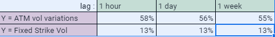
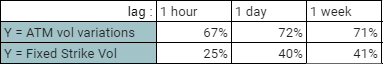
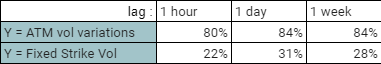

# Defining-Idiosyncratic-Volatility-with-Deutsche-Boerse-A7
What part of the implicit vol movement can be explained by the underlying spot and the global market ?

This project is based on Deutsche Börse's A7 service which provides intraday prices and visualization tools for all Xetra and Eurex instruments.
Using this service, our earlier Git https://github.com/canari-dev/Trades-Dynamics-with-Deutsche-Boerse-A7 shows how to get implicit volatility and forwards from options prices.
(see PricingAndCalibration.py and associated files)

Building on this work, we are now going to define Idiosyncratic Volatility.
Canari.dev runs machine learning algorithms on market related time series in order to predict parameters move.

When focusing on single stock options' implicit volatility, Canari.dev focuses on the part of the movement of the vol which cannot be explained by the underlying/Eurstoxx50 movement, what we call the idiosyncratic volatility :

There are two reasons for that :

1/ The more a parameter is specific and hard to trade (like a single stock vol), the most likely one is to find strong predictive signal on it because its price is less driven by arbitragers.
That's why the idiosyncratic vol is where we can look for strong signals.
In Machine Learning, you can not chase the proverbial two rabbits, so best focus on this part separatly.
The SX5E volatility and underlying stocks are very easy to trade and subject to intensive arbitrages so coming up with forecast signal on these would require very different techniques and should be seen as a separate job.

2/ A canArI user would rightly argue that the performance of his investment in options is determined by the "whole volatility", not not just the idiosyncratic part of its futures moves. 
Two possible answers : either to neutralize the impact of underlying / Eurostoxx50 moves with cheap (in terms of bid-offer spread) hedging in stock and SX5E options, or suplement the idiosyncratic vol estimator with another one focused specifically on stock moves and global (ie. SX5E) volatility.

# In canArI's indicators, we will often implicitely refer to the idiosyncratic vol moves rather than the ATM volatility moves.

-------------------------------------------------------------------------------------------
## Now let's see what we really mean by idiosyncratic vol  and what are its caracteristics  :

The Jupyter Notebook provided here shows how to run a regression betwwen the volatility moves and explanatory factors.
We will focus on 3 instances :

# 1/ Regressing single stock volatility moves on simulatneous underlying spot moves (*)

(This idea is linked to the measure of realized smile)

Graph : R2 factor of the regression ie. how much of the variance of Y can be explained by the regressors

Remarks :
The fixed strike vol, with only 13% R2 is very close to the idiosyncratic vol (which would have 0% of R2).
It is better than the ATM vol which is very much linked to spot moves.

# 2/ Adding the Eurostoxx50 spot and vol as regressors (*)

Graph : It is now a multiregression with 3 Xs : Underlying spot move, SX5E vol move, SX5E spot move

Remarks :
First we can see that SX5E (a proxy for global markets) explains c. 15% of variance on top of what the spot moves explains (or 1/3 of the remaining variance).
Also, it is interesting to see that the R2 is significantly higher for lag of 1 day and more.
This hints that over a few hours, the single stock vol can depart from it's mean spread with SX5E vol but will likely mean revert in a matter of 1 or 2 days.
This points to potential mean reverting indicators...

# 3/ Now having a look at the Eurostoxx50 index alone (*)

(mono regression of the vol moves on spot moves)

Graph : It is now a multiregression with 3 Xs : Underlying spot move, SX5E vol move, SX5E spot move

Remarks :
The SX5E's vol is much more linked to the spot of its underlying than single stock vols.
There is little room for idiosyncratic vol here, the vol is better arbitraged.

# (*) Context : 
R^2 of an OLS regression on maturities between 2 and 12 months.
All moves capped at 3 standard deviations
Period from April 2nd, 2019 to january the 31st, 2020.
- ATM vol is the at the money vol (Strike = Forward)
- Fixed strike vol is the vol of a strike fixed on the forward at the beginning of the period
